# 项目整体管理

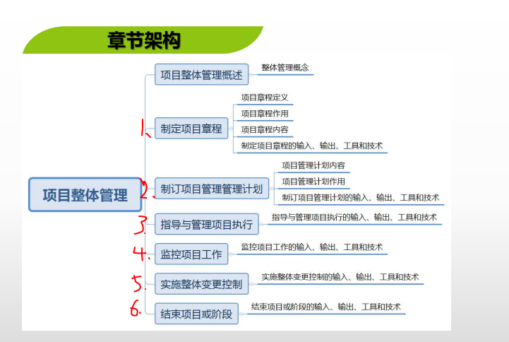

## 项目整体管理概述

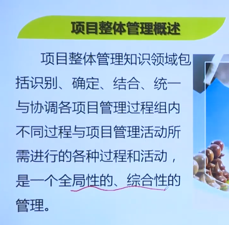

站在领导角度、全局角度

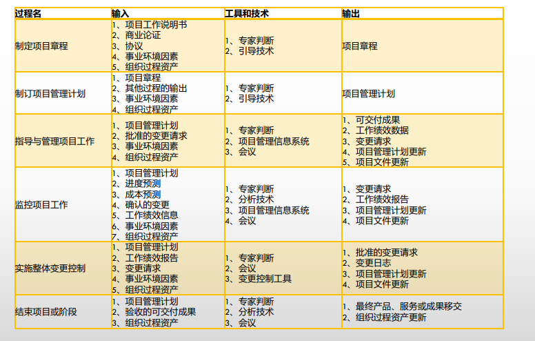

## 1. 制定项目章程

### 1. 项目章程概念

​	项目章程是正式批准项目的文件。

​	项目章程要对项目经理进行任命和授权允许动用组织的资源，由高管审批。

​	项目章程的审批标志着项目的正式启动。

​	项目经理可以参与项目章程的编写，审批由高管审批。

### **2. 项目章程的内容**

1. 项目的目的或者批准项目的原因
2. 可测量的项目目标和相关的成功标准
3. 项目的总体要求
4. 概括性的项目描述
5. 项目的主要风险
6. 总体里程碑进度计划
7. 总体预算
8. 项目审批要求（用什么标准评价成功，谁下结论，谁签署项目结束）
9. 委派的项目经理以及职责与职权
10. 发起人或者其他批准项目章程人员的姓名和职权

### 3. 工作说明书

​	对应有项目提供的产品或服务的文字说明

​	指明如下：

	1. 业务需求
	1. 产品范围说明书
	1. 战略计划

### 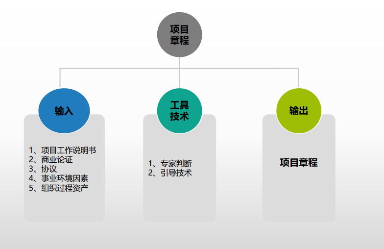

## 2. 制定项目管理计划

​	**1. 滚动波浪计划，远期粗，近期细**

​	**2. 需要干系人参与**

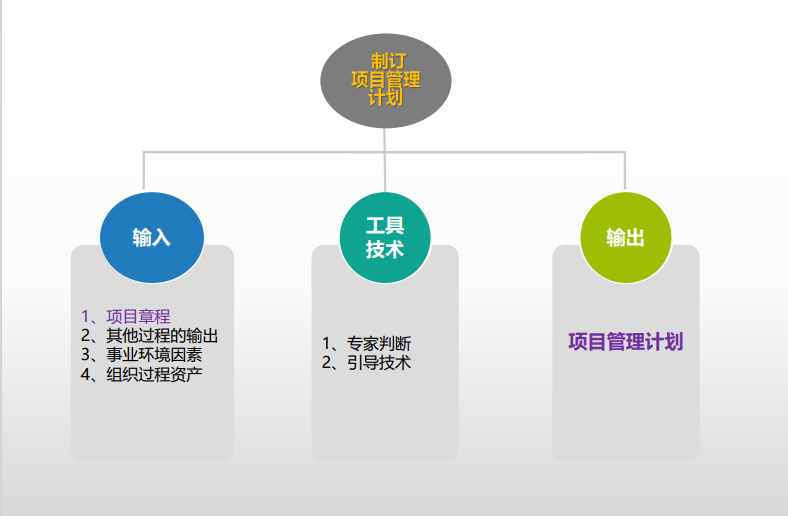

## 3. 指导与管理项目执行

按照计划执行

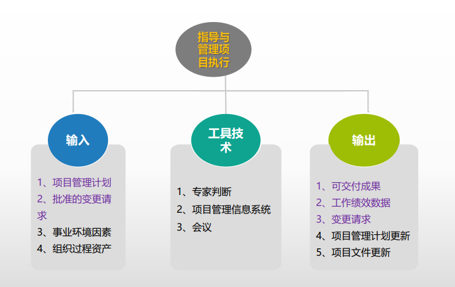

	### 	项目管理信息系统

​		项目管理信息系统是由用于归纳、综合和传播项目管理程序输出的工具和技术 组成。

​		由**计划系统**和**控制系统**组成

​		**配置管理系统**和**变更控制系统**，在项目管理信息系统中使用

	### 	工作绩效数据、工作绩效信息、工作绩效报告

例：

			1. 工作绩效数据: 0.9
			1. 工作绩效信息：进度滞后
			1. 工作绩效报告：形成的报告文档，包含绩效数据，来源，以及如何分析得出的绩效信息，需要改进的地方		

## 4. 监控项目工作

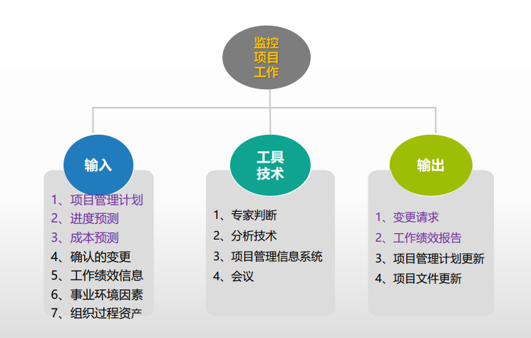

## 5. 实施整体变更控制

整体变更控制过程贯穿于项目的始终。由于项目很少会准确地按照项目管 理计划进行，因而变更控制必不可少

**整体变更控制过程中的几个配置管理活动如下**。 

1. 配置识别。是确定与核实产品配置、标识产品与 文件、管理变更，以及保持信息公开的基础。

2. 配置状态记录。捕捉、存储和评价有效地管理产品 和产品信息所需的配置信息。

3. 配置核实与审计。查明配置文件中确定的性能与功能要求已经达到。 

   

   整体变更控制过程包括一个负责批准或否决变更请求的变更控制委员会

   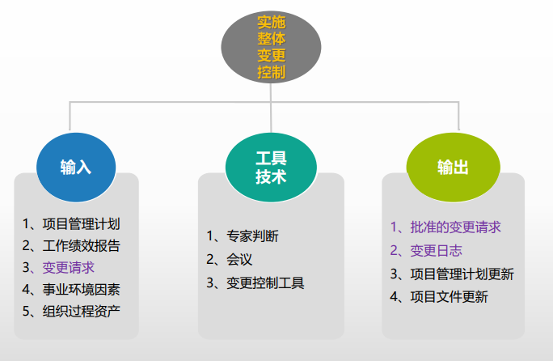

   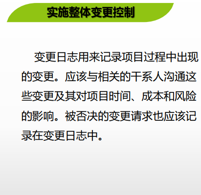

## 6. 结束项目或阶段

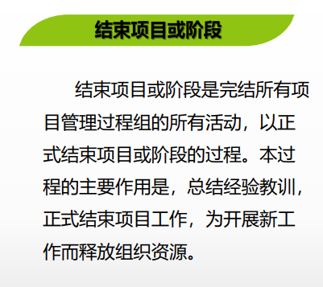

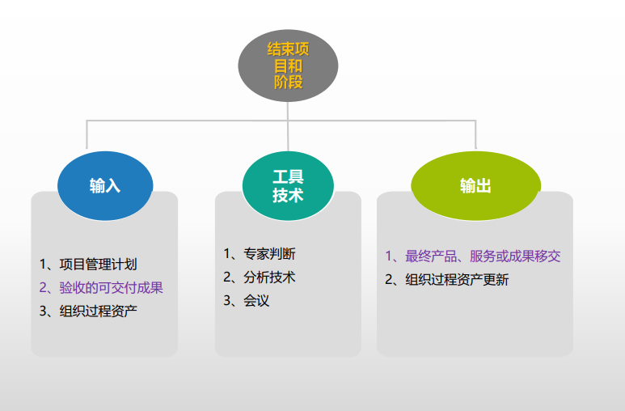

## 习题

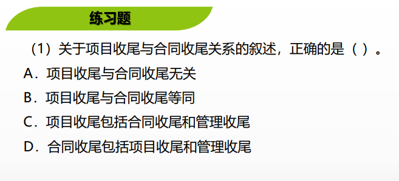

解析：C 每个阶段都有管理首位，等合同收尾后仍有管理收尾，如 项目尾款，项目奖金，项目总结等。项目收尾包括合同收尾和管理收尾。

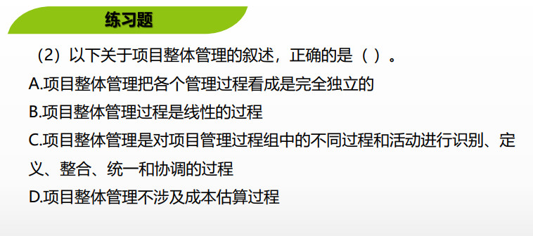习题解析：项目整体管理是一项综合性、统筹性的管理工作，它的任 务是保证项目管理的各个要素之间相互协调，达到最优组合状态。 项目整体管理是对项目管理过程组中的不同过程和活动进行识别、定 义、整合、统一和协调的过程，各个管理过程都不是独立的，成本估 算过程也是其中一个过程。 项目整体管理是一个迭代的过程，遵循PDCA原则。 参考答案：（C)

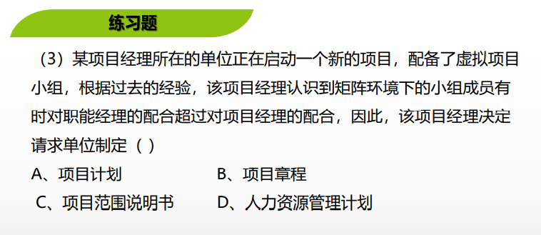

习题解析：项目章程多数由项目出资人或项目发起人制定和发布的， 它给出了关于批准项目和指导项目工作的主要要求，所以它是指导项 目实施和管理工作的根本大法。项目章程规定了项目经理的权限及其 可使用的资源，所以项目经理多数应该在项目章程发布的时候就确定 下来，以便他们能更好地参与确定项目的计划和目标。 参考答案：（B)

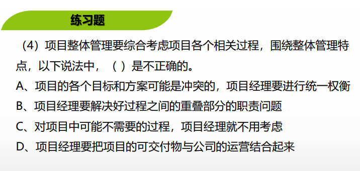

习题解析：大多数有经验的项目管理人员知道并不存在一个唯一的管 理项目的方法。为了取得期望的项目绩效，他们在不同的顺序和程度 上应用项目管理知识、技术和需要的过程，然而，不需要一个特定的 过程并不意味不去确定过程。项目经理和项目团队必须针对每个特定 项目确定其中的每一个过程及其实施程度。 参考答案：（C）

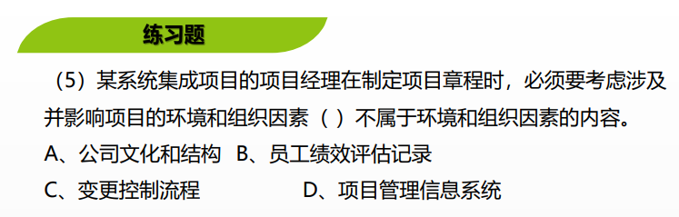

习题解析：在制定项目章程时候，必须考虑某些或所有涉及并影响项目成 功地组织环境和组织的因素系统。这些因素和系统包括下列几项：1、组 织或公司文化和结构2、政府或行业标准（如规章制度、产品标准、质量 标准、劳务关系标准）3、基础设施，如：已存在的设施和固定资产4、现 有的人力资源，如：技能、专业知识（设计、开发、法律、合同和采购） 5、人力资源管理，如：招聘和解聘的指导方针，员工绩效评估和培训记 录等6、市场条件7、项目关系人对风险的容忍度8、商业数据库，如业界 的风险研究信息和风险数据库、成本预算数据等9、项目管理信息系统， 如：一个自动工具集，一个与配置管理系统相结合的进度制定工具。 参考答案：（C)

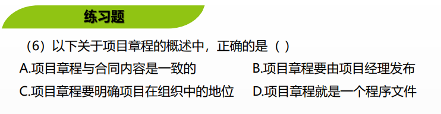

习题解析：项目章程的主要作用包括正式宣布项目的存在，对项目的开始 实施赋予合法地位；确保项目成功实现目标；粗略地规定项目的范围；正 式任命项目经理，授权其使用组织的资源开展项目活动。 参考答案：（C)

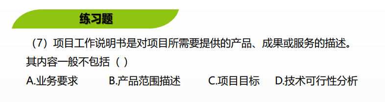

习题解析：项目工作说明书包括以下内容： (1)业务需要。组织的业务需要可基于市场需求、技术进步、法律要求、政 府法规或环境考虑。通常，会在商业论证中，进行业务需要和成本效益分 析，对项目进行论证。 (2)产品范围描述。记录项目所需产出的产品、服务或成果的特征，以及这 些产品、服务或成果与项目所对应的业务需要之间的关系。 (3)战略计划。战略计划文件记录了组织的愿景、目的和目标，也可包括高层级的使命阐述。所有项目都应该支持组织的战略计划。确认项目符合战 略计划，才能确保每个项目都能为组织的整体目标做贡献 参考答案：（D）

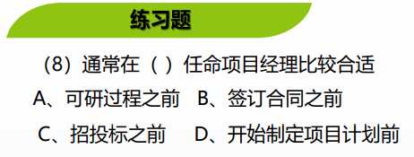

习题解析：组织根据项目的特点和要求，为项目指派合适的项目经理，同 时为项目经理颁发正式的项目经理任命书。组织通常在项目启动会议中公 布对项目经理的正式任命以及为项目经理颁发任命书。所以一般是在开始制定项目计划前任命项目经理(指定项目章程)。签订合同在执行过程组，招投标也是在执行过程组 参考答案：（D）

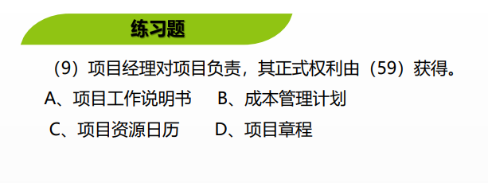

习题解析：考查的是项目章程的作用，项目章程为项目经理授权。 参考答案：（D）